# git-cleanup

[](https://github.com/Asunachi/git-cleanup/actions/workflows/ci.yml)
[](https://www.npmjs.com/package/@maliqkara/gitcleanup)
[](LICENSE)
[](https://nodejs.org)
[](https://github.com/Asunachi/git-cleanup/actions/workflows/pages.yml)

A zero-dependency CLI that keeps your Git workspace pristine: it scans local
and remote branches, cross-references each branch's activity (last commit,
merge status, upstream state) with its pull-request status on GitHub,
GitLab, Bitbucket (Cloud and self-hosted Server/Data Center), and
Gitea-family forges, then safely prunes what is
genuinely dead — merged branches past an age threshold, abandoned remote
branches, and scratch branches you opted into deleting.

Built on the `git` binary only (never touches `.git` internals) with optional
GitHub, GitLab, Bitbucket (Cloud and Server), and Gitea enrichment via
`gh` CLI or a
`GITHUB_TOKEN`/`GITLAB_TOKEN`/`BITBUCKET_TOKEN`/`GITEA_TOKEN`. Requires
**Node.js ≥ 18**, zero npm dependencies.

## Contents

- [What this repo demonstrates](#what-this-repo-demonstrates) — the skills behind it
- [Install](#install) — npx, npm, Homebrew, from source
- [How it compares](#how-it-compares) — git-cleanup vs. other cleaners
- [Safety model](#safety-model) — nothing is ever deleted automatically
- [Usage](#usage) — `scan` / `prune` / `prs` / `sweep`
- [GitHub integration](#github-integration) — PR-aware decisions
- [Configuration](#configuration) — layered config, rules, multi-repo
- [Automation / exit codes](#automation--exit-codes) — JSON + `--check` for CI
- [GitHub Action](#github-action-unattended-scan-reports) — unattended reports
- [Shell integration](#shell-completions) — completions, auto-scan hooks, pre-commit
- [Performance](#performance) — measured scan times
- [Development](#development) — tests, lint, playground
- [Forge support](#forge-support) — GitHub, GitLab, Bitbucket, adding more
- [Limitations & roadmap](#limitations--roadmap)

<p align="center">
  <video src="demo.mp4" controls preload="metadata" width="92%" poster="demo.gif" aria-label="60-second walkthrough of git-cleanup: scan, prune, backup list, and restore on facebook/react">
    <a href="demo.mp4">Watch the 60-second walkthrough (demo.mp4)</a>
  </video>
  <br />
  <em>the 60-second walkthrough, real terminal output on <code>facebook/react</code>, no cuts:
  <code>scan</code> → <code>prune</code> (bundles everything first) → <code>backup list</code> → <code>backup restore</code></em>
</p>

<p align="center">
  
</p>

**Try the [interactive playground](https://asunachi.github.io/git-cleanup/)** —
a simulated repo running the real decision engine in your browser: drag the
age thresholds and watch every branch re-classify live. The site also hosts
the [reference docs](https://asunachi.github.io/git-cleanup/docs/) —
install, usage, the full config schema, per-forge setup, automation, and an
FAQ — plain HTML, shipped from this repo on every deploy. The page deploys
automatically from this repo on every `main` push — and the release
workflow pushes the release commit to `main` before tagging, so the site
always mirrors the published release. The deploy also runs the
test suite under Node's built-in coverage reporter and serves
[`coverage.json`](https://asunachi.github.io/git-cleanup/coverage.json) —
the data behind the coverage badge above, recomputed on every deploy so it
always describes exactly the tree the site publishes.

```
$ git-cleanup scan
$ git-cleanup prune            # deletes nothing without confirmation
$ git-cleanup prune --remote   # also git push --delete on merged branches
$ git-cleanup prs --close      # stale open PR automator
$ git-cleanup sweep            # every configured repo in one pass
```

## What this repo demonstrates

A deliberately small project with a real production surface — a CLI, a
GitHub Action, a Homebrew tap, a CI matrix, an interactive playground, and
a documented release process — so each of these is exercised for real,
not in a tutorial:

| You'll find | What it exercises |
| --- | --- |
| Five forge providers behind one contract (`src/forge.mjs` + `src/providers/`) | API integration — REST dialects, auth, pagination — and abstraction design: a new forge is one file plus one registry line |
| Zero npm dependencies, Node built-ins only | Dependency discipline: deliberate, documented, and lint-enforced |
| Bundle-before-delete pruning with confirmation gates | Safety-critical design: irreversible operations made recoverable, auditable, and dry-runnable |
| 241 unit + integration + fuzz tests, structural tests pinning CI/templates so they can't drift | Testing at every level, including seeded fuzz and golden histories (rebase/cherry-pick/octopus) |
| CI on 3 OS × 3 Node versions, a release workflow, an auto-updating Homebrew tap, GitHub Pages | CI/CD and distribution: GitHub Actions, npm packaging, Homebrew, Pages |
| CONTRIBUTING with a real release runbook, SECURITY.md, Keep-a-Changelog, 60-second demo video | Documentation that treats the next contributor and reviewer as first-class users |

## Install

The npm package is **`@maliqkara/gitcleanup`** (the unscoped name
`git-cleanup` is held by an unrelated project, and npm blocks lookalikes);
the CLI command stays `git-cleanup`.

| Method | Command |
| --- | --- |
| Try it, no install | `npx -y @maliqkara/gitcleanup@latest scan` |
| Install globally | `npm install -g @maliqkara/gitcleanup` |
| Homebrew | `brew tap Asunachi/git-cleanup && brew install git-cleanup` |
| GitHub CLI | `gh extension install Asunachi/gh-git-cleanup` → `gh git-cleanup scan` |
| From source | `git clone https://github.com/Asunachi/git-cleanup.git && cd git-cleanup && node bin/git-cleanup.mjs scan` |

Pin `@latest` when using `npx` — npm ≥ 11's `npx` needs the explicit
version to resolve a scoped package's bin. The Homebrew formula lives in a
dedicated tap repository,
[Asunachi/homebrew-git-cleanup](https://github.com/Asunachi/homebrew-git-cleanup),
and is kept current automatically: that repo's `update-formula` workflow
bumps it to each new release (daily poll, no secrets). There is no build
step and no `npm install` for any method: the tool runs on Node built-ins
only.

The **`gh` extension**
([Asunachi/gh-git-cleanup](https://github.com/Asunachi/gh-git-cleanup)) runs a
real install when you have one and falls back to `npx`, and hands the tool
gh's own auth token — so PR enrichment works with zero extra setup. The
**GitHub Action**
([Asunachi/git-cleanup-action](https://github.com/Asunachi/git-cleanup-action))
is a stable-name wrapper around the `scan-report` action below; its
self-test workflow runs the action on itself weekly, and an auto-bump
workflow re-pins it to each new release.

Then, inside any git repository:

```bash
git-cleanup scan
```

### Shell completions

Tab completion ships for bash, zsh, and fish:

```bash
git-cleanup completions bash > ~/.local/share/bash-completion/completions/git-cleanup
# zsh:   git-cleanup completions zsh > "${fpath[1]}/_git-cleanup"   (then: compinit)
# fish:  git-cleanup completions fish > ~/.config/fish/completions/git-cleanup.fish
```

Restart your shell (or run `compinit` for zsh) and `git-cleanup <TAB>`
completes commands, flags, and file arguments.

### Automatic scans on every `cd` (shell hooks)

Want branch hygiene without thinking about it? A shell hook runs
`git-cleanup scan --summary` (one compact line per repo) whenever you `cd`
into a git repository — and once for the directory each shell starts in —
but at most once per repository per hour, so prompts stay snappy:

```bash
git-cleanup shell-hook bash >> ~/.bashrc      # or: zsh >> ~/.zshrc, fish
# fish: git-cleanup shell-hook fish > ~/.config/fish/conf.d/git-cleanup.fish
```

The hook only **reports** — it never deletes anything — and scans offline
(`--no-pr`) so a flaky network can never slow down or hang your prompt.
Knobs: `GIT_CLEANUP_DISABLE=1` turns it off, `GIT_CLEANUP_SCAN_INTERVAL`
changes the per-repo throttle (default 3600s), `GIT_CLEANUP_PR=1` enables
PR enrichment, `GIT_CLEANUP_ARGS` passes extra flags.

### A pre-commit reminder

A sample `pre-commit` hook prints a reminder when your repository has
prunable branches — it **warns, never blocks** commits, and also runs
offline:

```bash
git-cleanup shell-hook pre-commit > .git/hooks/pre-commit && chmod +x .git/hooks/pre-commit
```

Set `core.hooksPath` to a shared hooks directory to apply it to every repo
on the machine. All snippets live in `support/dotfiles/` in the npm package
and the repository.

## How it compares

Other branch cleaners exist, and several are good. git-cleanup is the one
that cross-references forge state (an open PR keeps its branch alive; a
closed-unmerged PR flags it abandoned), detects squash/rebase merges by
content, and never deletes anything a human didn't confirm — with a backup
bundle written before any deletion that could lose unique commits.

| Tool | PR-aware | Squash/rebase detection | Recovery net | Forges | Status |
| --- | --- | --- | --- | --- | --- |
| **git-cleanup** | ✅ open/merged/closed PR state | ✅ content fingerprint (tip tree in base history) | ✅ git bundles before force/remote deletes | GitHub + GitLab + Bitbucket + Gitea | actively maintained |
| `git branch --merged` / `git branch -d` (built-in) | ❌ | ❌ | n/a (safe by construction) | git | ships with git |
| [git-sweep](https://github.com/arc90/git-sweep) | ❌ | ❌ | ❌ | git | unmaintained (last activity ~2016) |
| [git-delete-merged-branches](https://github.com/hartwork/git-delete-merged-branches) | ❌ | ❌ | ❌ | git | actively maintained (Python) |
| git-extras `git delete-merged-branches` | ❌ | ❌ | ❌ | git | actively maintained |
| [git-clean-gone](https://github.com/DeflateAwning/git-clean-gone) | ❌ | n/a (different job: prune tracking refs of deleted remotes) | ❌ | git | actively maintained (Rust) |
| GitHub “automatically delete head branches” | ✅ merged PRs only | ✅ (GitHub knows the PR) | ❌ | GitHub UI only | ships with GitHub |

Why that matters in practice: ancestry-only tools delete a squash-merged
branch's *unmerged-looking* twin as “unmerged” (or keep it forever), and
without PR state nothing distinguishes an abandoned branch from one whose PR
is still in review. git-cleanup was built for exactly those two gaps.

## Safety model

Nothing is ever deleted automatically. Decisions are conservative:

| Verdict | What it means | What it takes to delete |
| --- | --- | --- |
| **PRUNE** | Merged into a base branch and older than the threshold (or matched an explicit rule) | `git-cleanup prune` + confirmation |
| **stale** | Unmerged and untouched for a long time, or an abandoned PR | never deleted automatically; review in `scan` |
| **kept** | Protected (see below), the checked-out branch, a base branch, an open PR, or simply too young | — |

* Merged = the branch tip is an ancestor of a base branch. Base branches are
  each remote's default branch (resolved offline via `origin/HEAD`, the
  checked-out branch's upstream, or well-known names like `main`). Unmerged
  work is **never** deleted unless it matches a `mode: "any"` force rule you
  wrote yourself.
* Squash/rebase merges are detected by **content**: when a branch's tip tree
  already exists somewhere in a base branch's history, the branch is treated
  as merged even though its commit SHAs were rewritten. Because ancestry is
  absent those refs are removed with `-D` — safe here, since every file of
  the branch already lives in the base branch. Net-empty branches (no-op
  commits, fully reverted work) are excluded: the matching tree must differ
  from the tree at the branch's own starting point.
* Protected by default: `main master develop dev release release/** staging
  qa trunk`, every base branch, the currently checked-out branch, and anything
  matching your `protected` list. A remote branch is protected by the same
  names (`release/**` protects `origin/release/v1`).
* Local cleanup uses `git branch -d` for ancestor merges; squash/rebase-merged
  and force-rule branches are removed with `-D` (content preserved in the
  base, or explicitly opted in), each behind its own confirmation.
* Remote cleanup only runs with `--remote` and only for merged branches
  (configurable via `remote.pruneMerged`) or PR-abandoned branches
  (`remote.deleteAbandonedAfterDays`).
* In a non-interactive session (no TTY), prune refuses to run without `--yes`.
* **Deletions that lose unique commits are backed up first.** Before removing
  squash/rebase-merged branches (`-D`), force-rule branches (`-D`), or remote
  branches (`git push --delete`), their refs are written to a timestamped git
  bundle in `<git dir>/git-cleanup-backups/` — so `-D` is no longer
  unrecoverable. Branches deleted with plain `-d` (ancestor-merged) stay
  reachable from the base and need no backup. A failed backup aborts the
  deletion. Disable with `"backup": { "enabled": false }`, move bundles via
  `"backup": { "dir": "/path" }`, or set a retention window
  (`"backup": { "retainDays": 90 }`) so `prune` sweeps bundles older than
  that on every run (0, the default, keeps them forever). Restore a bundled
  branch:

  ```bash
  git fetch .git/git-cleanup-backups/backup-*.bundle "+refs/heads/*:refs/heads/*"
  ```

## Usage

### `git-cleanup scan` (default command)

Reports every branch that could be cleaned up and every stale one worth a look:

```
$ git-cleanup scan --verbose

📦 /path/to/repo
base: origin/main   HEAD: main
  STATUS  BRANCH                       TYPE    AGE   MERGED  PR              REASON
  PRUNE   feature/merged-old           local   60d   yes     merged #12      merged into base
  PRUNE   origin/feature/merged-old2   remote  50d   yes     -               merged into base
  stale   wip/abandoned                local   100d  -       closed #4        unmerged and stale
  ...
  3 prunable · 2 stale · 5 kept
  → git-cleanup prune  /  git-cleanup prune --remote to delete them
```

Without `--verbose` only PRUNE/stale rows are shown. `--json` emits the full
machine-readable report (see “Automation”). For CI, `--check` exits with
code **2** when anything is prunable:

```bash
git-cleanup scan --check --json && echo "workspace is clean"
```

### `git-cleanup prune`

Prints the candidates, then asks before deleting, grouped by risk:

1. ancestor-merged local branches (default answer **yes**),
2. squash/rebase-merged local branches — content provably exists in a base
   branch (default **yes**; net-empty or coincidentally-matching branches are
   never flagged),
3. unmerged branches matched by force rules (default **no**),
4. merged/abandoned remote branches when `--remote` is passed (default **yes**,
   only offered with `--remote`).

Ancestor-merged branches are deleted with plain `-d`. If git refuses because
the branch is merged into a remote base branch but not your local `HEAD` (a
stale local default branch), git-cleanup backs the branch up and
force-deletes it instead: the scan already proved its commits are reachable
from the base, and the safety bundle covers even that ref disappearing
later. A failed backup aborts the deletion.

If `push --delete` fails because the branch was already deleted on the server
(web UI, another machine, an earlier run), git-cleanup prunes the stale local
tracking ref instead of reporting an error — verified with `ls-remote`, so
auth/network failures and protected-branch refusals still surface as errors.

Pass `--yes` (or `--force`, its alias — or set `GIT_CLEANUP_YES=1`) to run
non-interactively. Remote deletion is `git push <remote> --delete <branch>`.

### `git-cleanup prs` — the stale PR automator

Lists open pull requests with no activity for `pr.staleAfterDays` (default 30):

```
$ git-cleanup prs
📦 /path/to/repo  (org/repo)
  • #412 61d  Upgrade the widget parser  [draft]
```

To actually close them (with a comment), opt in twice — via config
(`"closeStaleAfterDays": 60`) and the `--close` flag:

```bash
git-cleanup prs --close        # asks first
git-cleanup prs --close --yes  # for a nightly cron
```

`prs --json` always prints **one parseable JSON document** — an array in
input order with one entry per readable repo (`{ path, repo, staleAfterDays,
prs }`), and an `error` entry where a repo or its PR backend failed, so
consumers never have to handle empty or concatenated output.

Only open PRs older than `closeStaleAfterDays` (falls back to
`staleAfterDays`) are closed. Closing PRs never deletes branches — run
`git-cleanup prune` separately for that.

### `git-cleanup sweep` — one pass over every configured repo

`sweep` is the automation command: it walks the `repos` list from the config,
scans each repo, applies each repo's mode, and produces **one markdown report
and one JSON document for the whole run** — optionally posting the report as
a forge issue:

```bash
git-cleanup sweep --json                       # scan everything, machine-readable
git-cleanup sweep --report sweep-report.md     # also write a combined markdown report
git-cleanup sweep --report-issue "Cleanup" --dry-run   # rehearse the issue post
git-cleanup sweep --yes                        # prune, per the config policy
```

Safety-first by construction: the default mode is **`report`** — a sweep with
no config **deletes nothing**. Pruning requires both a policy opt-in and the
same confirmation gate as `prune`:

```jsonc
{
  "sweep": {
    "mode": "prune",        // "report" (default, never deletes) | "prune"
    "remote": false,         // also delete remote branches during sweep
    "reportFile": "sweep.md", // write a combined report (relative to this file)
    "reportIssue": true       // true = default title, or { "title": "..." }
  },
  "repos": [
    ".",
    { "path": "../other-project", "mode": "prune" }  // per-repo override
  ]
}
```

In `prune` mode every deletion goes through `confirmed()` — non-interactive
runs (cron, CI) **must** pass `--yes` or fail loudly with nothing deleted.
`--dry-run` scans and searches (read-only) but never deletes and never
posts. With `sweep.reportIssue` (or `--report-issue <title>`), the report is
posted to the **first repo with a recognized forge remote**; a configured
post with nowhere to post is a loud error, never a silent skip. In JSON mode
stdout carries exactly one JSON document (prune's human block moves to
stderr). The JSON shape:

```jsonc
{
  "tool": "git-cleanup", "command": "sweep", "generatedAt": "...",
  "dryRun": false, "mode": "report",
  "report": { "file": "...", "written": true } | null,
  "issue": { "dryRun": false, "action": "created", "number": 3, "url": "..." } | null,
  "repos": [
    { "path": "...", "mode": "report", "prunable": 3, "stale": 2, "kept": 5,
      "prunableBranches": [...], "staleBranches": [...],
      "deletedLocal": [...], "deletedRemote": [...], "prunedRemote": [...],
      "deletedBackups": [...], "backups": [...], "errors": [] }
  ]
}
```

The classic setup — a nightly cron that prunes every configured repo and
posts the report:

```bash
# ~/.config/git-cleanup/config.json
#   { "sweep": { "mode": "prune", "reportIssue": true }, "repos": [...] }
# crontab:
0 4 * * *  cd /path/to/config-dir && git-cleanup sweep --yes
```

### `git-cleanup doctor` — the environment check

One command answers "why isn't PR tracking working?": it checks git and
`gh`, every forge token, config validity (including `forge.hosts` claims),
and how each of the repo's remotes resolves:

```
$ git-cleanup doctor

git-cleanup doctor
  ✓ git version 2.43.0
  ✓ gh version 2.50.0
  ⚠ github token GITHUB_TOKEN — not set — set GITHUB_TOKEN to enable github PR enrichment and report-issue
  ...
  ✓ config: defaults < ~/.config/git-cleanup/config.json
    forge.hosts: git.internal → gitea
  ✓ repo /path/to/repo — 1 remote
  ✓ origin → github (github.com)

  6 ok · 4 warnings · 0 errors
```

Missing tokens, a missing `gh`, and unrecognized remotes (with a
copy-pasteable `forge.hosts` hint) are **warnings** — pure-git cleanup still
works — while a missing git binary or a broken config are **errors** that
exit 1. `doctor --json` prints the whole report as one machine-readable
document for scripts.

### `git-cleanup backup` — see and restore what prune saved

Before deleting anything that would lose unique commits (squash/rebase
`-D`, force-rule `-D`, remote deletes), prune writes a timestamped git
bundle. These commands make that safety net visible and restorable:

```
$ git-cleanup backup list

📦 /path/to/repo
  backup dir: /path/to/repo/.git/git-cleanup-backups
  backup-2026-09-05T22-38-42-618Z-force.bundle
    created 2026-09-05 · 12 KB · 1 branch: refs/heads/tmp/scratch
    restore: git-cleanup backup restore backup-2026-09-05T22-38-42-618Z-force.bundle
  ⚠ backup-2025-03-01T...-squash.bundle — older than backup.retainDays (30d); the next prune will sweep it
```

`backup restore <bundle>` fetches every branch in the bundle back **only if
it does not already exist locally** — exact refspecs, no force — so a
restore can never clobber current work; branches that exist are skipped with
a note. It confirms first (`--yes` for scripts), and `backup list --json`
prints the whole inventory (`file`, `sizeBytes`, `created`, `branches`,
`wouldSweep`) for automation. Restoring is just `git fetch` under the hood,
so a restored branch can be deleted again with plain git.

## GitHub integration

PR state enriches the scan but never deletes anything by itself: an open PR
keeps its branch alive, a merged or closed PR is shown for context, and a PR
closed without merging can flag a remote branch as abandoned when you enable
`remote.deleteAbandonedAfterDays`. Deleting a branch always requires git
evidence — its tip is an ancestor of a base branch, or its final tree
already exists in base history (the squash/rebase fingerprint) — or an
explicit force rule.
git-cleanup queries GitHub, in order:

1. the **`gh` CLI** if installed and authenticated, or
2. the **GitHub REST API** if `GITHUB_TOKEN` is set.

Without either, PR columns show `-` and cleanup falls back to pure git merge
detection (this is what runs in the tests and works fully offline). Only
GitHub, GitLab, Bitbucket (Cloud and Server), and Gitea-family remotes
are queried (see "Forge support"); other remotes are ignored.

**Truncation is never silent.** PR lists are fetched in pages; very large
repositories (over the fetch cap — currently 2,000 PRs via any REST API,
500 via `gh`) stop paging and report `truncated: true` in `scan --json`
plus a visible warning in the human report and `prs` output, so branches
past the cap are never judged against a partial PR picture without you
knowing.

## Configuration

Config files merge in this order (later wins):

1. built-in defaults
2. `~/.config/git-cleanup/config.json`
3. `.gitcleanup.json` (or `.git-cleanup.json`), found by walking up from the
   current directory — perfect for per-repo rules
4. a file passed via `--config <file>`

```jsonc
{
  // Globs never touched, on top of the built-in protected list.
  "protected": ["special/release", "vendor/**"],

  // Merged branches older than this (days, from the tip commit) are prunable.
  "deleteMergedAfterDays": 21,

  // Unmerged branches older than this are flagged as stale (never deleted).
  "warnUnmergedAfterDays": 45,

  // Per-name rules. mode "merged" = custom age for merged branches;
  // mode "any" = force-delete even when unmerged (local only — opt in!).
  "rules": [
    { "match": "feature/ci-*", "mode": "merged", "minAgeDays": 7 },
    { "match": "tmp/**", "mode": "any", "minAgeDays": 1 }
  ],

  "pr": {
    "track": true,
    "staleAfterDays": 30,
    "closeStaleAfterDays": 60,
    "closeComment": "Auto-closed by git-cleanup — reopen if still needed."
  },

  "remote": {
    "pruneMerged": true,
    "deleteAbandonedAfterDays": 0 // >0 enables deleting remote branches whose PR closed unmerged
  },

  // Claim self-hosted forge hostnames that the built-in detection can't
  // recognize (used by PR tracking and report-issue alike). An explicit
  // mapping always wins over the hostname heuristics.
  "forge": {
    "hosts": {
      "git.example.com": "gitlab",
      "git.internal": "gitea"
    }
  },

  // Safety net: bundle refs before -D / remote deletions (default on).
  // "dir": null keeps bundles in <git dir>/git-cleanup-backups.
  // "retainDays": 0 keeps backups forever; >0 makes prune sweep older ones.
  "backup": {
    "enabled": true,
    "dir": null,
    "retainDays": 0
  },

  // Scan more than one repository at once (paths resolve relative to this file).
  // Entries may be objects to give a repo its own sweep mode.
  "repos": ["../other-project", { "path": "/srv/legacy", "mode": "prune" }],

  // `git-cleanup sweep`: one pass over every repo above. "report" never
  // deletes (default); "prune" deletes through the same confirmation gate
  // as `prune` (--yes required in scripts/CI).
  "sweep": {
    "mode": "report",
    "remote": false,
    "reportFile": null,          // combined markdown report, or null
    "reportIssue": null          // true, { "title": "..." }, or null
  }
}
```

Rule semantics: the first matching rule for a branch wins. `mode: "merged"`
rules only fire for merged branches and use `minAgeDays` (default:
`deleteMergedAfterDays`); an unmerged branch matching one is kept with reason
`unmerged-rule`. `mode: "any"` rules fire on unmerged branches too with
`minAgeDays` defaulting to 0 — pair them with a meaningful age unless you
really want same-day scratch deletion, and note they can only affect local
branches.

## Automation / exit codes

| Code | Meaning |
| --- | --- |
| 0 | ok |
| 1 | error (bad config, not a git repo, failed delete, etc.) |
| 2 | `scan --check` found prunable branches |

Nightly cleanup via cron/CI (adjust with care — read the safety model first):

```bash
git-cleanup scan --check --json > /tmp/cleanup.json
git-cleanup prune --yes
git-cleanup prs --close --yes   # only if you configured closeStaleAfterDays
```

`--json` output is a single document with one entry per repo; every branch
carries `verdict` (`delete` | `warn` | `keep`), `reason`, `ageDays`, `merged`,
`orphan`, and PR info when available. Stable for piping into your own tooling.

## GitHub Action: unattended scan reports

A composite action (`Asunachi/git-cleanup/.github/actions/scan-report`) runs
`git-cleanup scan` on a schedule and keeps a single report issue up to date,
so branches that go stale while nobody is looking still get seen:

```yaml
name: branch report

on:
  schedule:
    - cron: "0 3 * * 1"     # weekly
  workflow_dispatch:

permissions:
  contents: read
  issues: write             # required to create/update the report issue

jobs:
  scan:
    runs-on: ubuntu-latest
    steps:
      - uses: actions/checkout@v5
      - uses: Asunachi/git-cleanup/.github/actions/scan-report@v0.3.0
        with:
          path: .
          report: issue
          issue-title: "git-cleanup: branch report"
```

Release tags: `v0.2.1` (first npm-published CLI version), `v0.2.2` (the
action + backup safety net), `v0.2.3` (action output fixes, backup
retention, forge abstraction), `v0.2.4` (GitLab provider, cross-platform
CI, interactive playground), `v0.2.5` (JSON contract + error-path fixes),
`v0.2.6` (`-d` fallback for remote-merged branches, end-to-end prs tests),
`v0.2.7` (single-source decision engine shared with the playground, flag-
parsing fixes), `v0.2.8` (CI freshness gate + fuzz parity tests), and
`v0.3.0` (current: the report-issue flow folded into the CLI behind the
forge `issues` contract, `doctor`, `backup list/restore`, `forge.hosts`
for self-hosted GitLab/Gitea, a `--force` alias, and the GitLab CI
template) — all matching what npm serves.
Pin `@v0.3.0` as shown; use `@main` only if you want the action to track
unreleased changes. (`v0.2.1`'s tree predates the action, so it cannot be
used to pin it.)

**Prefer the CLI over the action?** The same create-or-update posting is
built into the tool itself: `git-cleanup report-issue` works on *any*
forge — it reads the repository's remote, picks the matching provider
(GitHub, GitLab, Bitbucket, Gitea), and reuses the same token env vars as
PR enrichment (`GITHUB_TOKEN` / `GITLAB_TOKEN` / `BITBUCKET_TOKEN` /
`GITEA_TOKEN`). Run the scan, render with the action's markdown renderer,
post:

```bash
node bin/git-cleanup.mjs scan --json --repo . > scan.json
node .github/actions/scan-report/report.mjs scan.json report.md
GITHUB_TOKEN=… node bin/git-cleanup.mjs report-issue report.md
```

Add `--dry-run` to rehearse the post: it runs the same read-only search
as a real run, resolves create-vs-update, prints the would-be action and
target URL, and skips only the write. It needs the same env as a real run
(token included) — it is a full rehearsal minus the side effect.

**About the report issue you may see on this repo:** this repository's own
schedule (`.github/workflows/report-issue.yml`) keeps a single issue
titled `git-cleanup: branch report` current through that command — the
GitHub twin of the GitLab `report-issue` CI job. That issue is
**machine-generated and not a bug report** — the command creates it on
the first run and updates it in place on every run after. Please don't
file bug reports against it; open a fresh issue instead.

**Shallow checkouts are handled automatically.** CI clones default to
`fetch-depth: 1`, which hides history from merge detection (both ancestor
and squash/rebase checks). The action detects that, fetches full history
(`git fetch --unshallow`) with an explicit refspec covering every remote
branch, and only then scans — set `unshallow: "false"` if your checkout
step already uses `fetch-depth: 0`. If unshallowing fails the action warns
and still reports, but merge detection may be incomplete.

Inputs: `path` (default `.`), `unshallow` (default `true`), `report`
(`issue` keeps one issue with the exact `issue-title` updated per run,
`none` logs only), `issue-title`, `token` (defaults to `GITHUB_TOKEN`).
Outputs: `prunable`, `stale`, `kept`, `errors`, `issue-number`; the full
markdown report is also written to the step summary. Run it on a schedule
or `workflow_dispatch` against the default branch — on pull-request events
the checkout is the merge ref and the scan is less meaningful.

## Performance

Synthetic repositories with a linear base history plus a realistic branch mix
(merged, stale-divergent, active), scanned offline with `scan --json --no-pr`
on a single machine to isolate pure-Git cost (PR enrichment is network-bound
and separate):

| repo | base commits | branches | scan time |
|---|---:|---:|---:|
| small | 300 | 91 | 0.4 s |
| medium | 1,200 | 361 | 1.5 s |
| large | 3,000 | 751 | 3.2 s |

Scaling is roughly linear in the number of branches — each branch costs one
or two short `git` subprocesses (ancestry and content checks), and the base
history is walked once for the tree index. Expect wall-clock times to vary
with filesystem and repository size; on very large histories the single
`git log --format=%T` walk dominates. `prune` adds only the cost of the
deletions themselves plus a bundle write.

## Development

```bash
npm test    # node --test: unit + integration + fuzz against real throwaway repos
npm run coverage  # same suite under --experimental-test-coverage → writes coverage.json
npm run lint   # zero-dependency lint (syntax + whitespace invariants; runs in npm test too)
```

`npm run coverage` uses only Node's built-in test coverage (no dependencies)
and measures `src/` only — never the tests themselves — and refuses to write
a badge if any test fails. The file isn't committed: the Pages deploy
recomputes it and serves it for the README badge, so the number always
matches the published tree (see `.github/workflows/pages.yml`). CI also runs
it as a **coverage gate**: PRs and pushes that drop `src/` line coverage
below the last deployed baseline (beyond a 0.5pp tolerance band for
measurement noise) fail the build (`coverage-gate` job, GitHub-only — it
needs this repo's deployed baseline, which other projects' copies of
`.gitlab-ci.yml` don't have), so new code without tests can't land
silently.

Integration tests build a bare `origin` and a working clone with old merged
branches, an orphaned branch, stale unmerged work, and protected branches,
then assert `scan`, `prune`, and the CLI end-to-end (including `--check`
exit codes). Merge detection is additionally fuzzed against an oracle
model: a seeded generator builds random real repositories (merge / squash /
revert / no-op / divergent histories) and requires the analyzer's verdicts
to match each branch's true fate — `MERGE_FUZZ_CASES` and `MERGE_FUZZ_SEED`
scale and reseed it. The lint script is dependency-free and runs inside
`npm test`, so a commit that breaks syntax or formatting can never go
green.

## Limitations & roadmap

* Bitbucket Server/Data Center has **no native issue tracker** (issues live
  in Jira), so `report-issue` on a Server remote fails loudly — PR
  enrichment and `prs --close` work fine.
* Age is measured from the tip commit of each branch.
* PR lists are fetched up to a safety cap (2,000 via REST, 500 via `gh`);
  hitting the cap is reported, never silent (see “GitHub integration”).
* Merge detection is ancestry- or content-based (tip tree found in base
  history), which covers squash and rebase merges. It cannot detect merges
  whose code changed afterwards (e.g. cherry-picks that were amended), which
  is why PR status and your review of `stale` rows matter.

## Forge support

PR enrichment lives behind a small provider abstraction (`src/forge.mjs`):
forges implement one contract — parse their remote URLs, load merge/pull
requests keyed by head branch (`loadPRs`), and close one with a comment
(`closePR`) — and register in the `providers` map. All consumers read only
that common shape, so a new forge is a new `src/providers/<forge>.mjs` plus
one registry line, no changes in `analyze`/`classify`/`report`/`cli`/the
Action. Remotes are detected by hostname: `github.com`, `gitlab.com` (plus
self-hosted `*.gitlab.*` instances), `bitbucket.org` (Cloud), hostnames
containing `bitbucket` other than `bitbucket.org` (assumed Bitbucket
Server/Data Center), and the Gitea-family hosts `gitea.com`, `codeberg.org`,
and `forgejo.org` resolve to their providers; unrecognized hosts degrade to
pure-git cleanup with a clear message. The `forge.hosts` config map claims
extra hostnames explicitly (for example `{ "git.example.com": "gitlab",
"git.internal": "gitea", "stash.internal": "bitbucket-server" }`) for
self-hosted instances on custom domains — it always wins over the
heuristics and is honored by PR tracking and `report-issue` alike.

### Gitea / Codeberg / Forgejo

Gitea's REST API is deliberately GitHub-shaped, so this provider speaks the
same dialect: pull requests are read from `GET /api/v1/repos/{owner}/{repo}/pulls`
(`state=all`, sorted by `sort=recentupdate`), with pagination following the
`Link` header (falling back to `x-total-count`) and the same 2,000-item
truncation cap as every other provider. A merge shows up the GitHub way —
`state: closed` plus `merged_at` — so state mapping is identical. Closing a
PR (`prs --close`) is `PATCH .../pulls/:number` with `{"state": "closed"}`,
plus the comment on `.../issues/:number/comments`. Authentication is a
`GITEA_TOKEN` env var sent as `Authorization: token <token>`; the API base
is derived from the host (`https://gitea.com/api/v1`, `codeberg.org`,
`forgejo.org`) or overridden with `GITEA_API_BASE`. Self-hosted Gitea and
Forgejo instances on arbitrary domains can't be recognized by hostname
(unlike GitLab, "gitea" isn't in the host) — claim them with the
`forge.hosts` config (e.g. `{ "git.internal": "gitea" }`), which derives
the API base `https://<host>/api/v1` (standard install layout) or honors
`GITEA_API_BASE`.

### Bitbucket Cloud

Pull requests are read over the Bitbucket Cloud REST API (`state=OPEN` +
`MERGED` + `DECLINED` + `SUPERSEDED`, sorted by `-updated_on`), keyed by
`source.branch`, with pagination followed via the API's embedded `next` URL
and the same 2,000-item truncation cap as the other providers. Authentication
is a `BITBUCKET_TOKEN` env var (an [app
password](https://support.atlassian.com/bitbucket-cloud/docs/app-passwords/)
with pull-request read/write permissions suffices) sent as `Authorization:
Bearer`; without one, PR columns show `-` and cleanup falls back to pure
git detection. The API base defaults to `https://api.bitbucket.org/2.0`
(override with `BITBUCKET_API_BASE`). Closing a PR (`prs --close`) uses
`POST .../pullrequests/:id/decline` — the API's standard close-without-merge
action — and posts the comment to `.../pullrequests/:id/comments`.

### Bitbucket Server / Data Center

Self-hosted Bitbucket Server (now "Data Center") speaks a **different REST
API** under `/rest/api/1.0`, so it has its own provider behind the same
contract. A hostname containing `bitbucket` that is not `bitbucket.org` is
assumed to be a Server instance (`bitbucket.corp.com`,
`bitbucket.example.org`); arbitrary domains are claimed with `forge.hosts`
(`{ "stash.internal": "bitbucket-server" }`). Clone URLs —
`https://<host>/scm/PROJ/repo.git`, `ssh://git@<host>:7999/PROJ/repo.git`,
scp-like `git@<host>:PROJ/repo.git` — parse to a **project key + repo slug**
(Bitbucket Server projects have exactly one level, no nested groups). The
API base derives as `https://<host>/rest/api/1.0` (override with
`BITBUCKET_API_BASE`, shared with Cloud). Pull requests are read from
`GET .../projects/{key}/repos/{slug}/pull-requests` with the same four
states as Cloud, keyed by `fromRef.displayId`, with `start`-cursor
pagination (`isLastPage`/`nextPageStart`) and the same 2,000-item
pagination cap reported as `truncated`. Dates arrive as epoch **milliseconds**
and are converted to the shared ISO shape. Authentication is the same
`BITBUCKET_TOKEN` env var sent as `Authorization: Bearer` (a Data Center
personal access token). Closing a PR (`prs --close`) posts to
`.../pull-requests/:id/decline?version={version}` — Server declines are
optimistic-locked, so the loaded version is passed along and a concurrent
edit surfaces as an API error instead of a silent close — and comments use
Server's `{ "text": ... }` body. Bitbucket Server has **no native issue
tracker** (that is Jira's job), so this provider ships no `issues`
capability and `git-cleanup report-issue` on a Server remote fails loudly
rather than guessing an endpoint.

### GitLab

Merge requests are read over the GitLab REST API (`state=all`, keyed by
`source_branch`, newest activity first). Authentication is a `GITLAB_TOKEN`
env var sent as the `PRIVATE-TOKEN` header; without one, PR columns show `-`
and cleanup falls back to pure git detection. There is no CLI fast path
(GitLab has no universally-installed `gh`-equivalent), so the API is the
only backend. The API base is derived from the remote host —
`https://gitlab.com/api/v4`, or `https://<host>/api/v4` for self-hosted
instances (standard install layout; override with `GITLAB_API_BASE`).
Nested groups work: a remote like `git@gitlab.com:group/sub/repo.git`
resolves the project as `group/sub/repo`. Closing an MR
(`prs --close`) uses `PUT /merge_requests/:iid` with a `state_event: close`
and posts the comment as a note.

**GitLab CI.** The repository ships a ready `.gitlab-ci.yml` template that
mirrors the GitHub workflow: a Node 18/20/22 test matrix with the deep
50,000-shape parity sweep, a CLI smoke check, a playground-freshness gate,
a scheduled seed re-sweep, a scheduled `scan --check` job that fails its
pipeline when branches are prunable, and a scheduled `report-issue` job
that renders the scan with the *same markdown renderer the GitHub side
uses* and keeps one issue titled `git-cleanup: branch report` current via
the Issues API — authenticated with `GITLAB_TOKEN`, a masked project
token with `api` scope (validated against a live instance: GitLab does
not grant CI/CD job tokens Issues API write access by default, so
`CI_JOB_TOKEN` is only a fallback for projects that configure Settings →
CI/CD → Job token permissions). The GitHub twin of that job is
`.github/workflows/report-issue.yml`, which runs the same
`git-cleanup report-issue` command (posts with the automatic
`GITHUB_TOKEN`, no `gh` binary needed) — the command detects the forge
from the remote, so the identical invocation works on GitHub, GitLab,
Bitbucket Cloud, and Gitea (forges without a native issue tracker, like
Bitbucket Server, fail loudly), and `--dry-run` rehearses the post
(read-only search resolves create-vs-update, only the write is skipped). Both
scheduled report jobs rehearse with `--dry-run` before posting, so a
broken token or API change fails the run loudly instead of silently
skipping the report. Copy
the template to your repo root (or merge its jobs into an existing
`.gitlab-ci.yml`) and create a schedule under **CI/CD → Schedules** for the
nightly pieces. Set `GITLAB_TOKEN` (a project access token with `read_api`)
if you want the scan job's PR enrichment.

Roadmap, in order of expected value:

1. **A dedicated Homebrew tap repository** — *done*: the formula now lives
   in its own repo (`Asunachi/homebrew-git-cleanup`; tap name
   `Asunachi/git-cleanup`), auto-updated by that repo's release workflow;
   this repository no longer ships a formula.
2. **A hosted demo of the scheduled report issue** — point the report
   workflows at a public repo so the weekly `git-cleanup: branch report`
   issue is visible as living proof.
